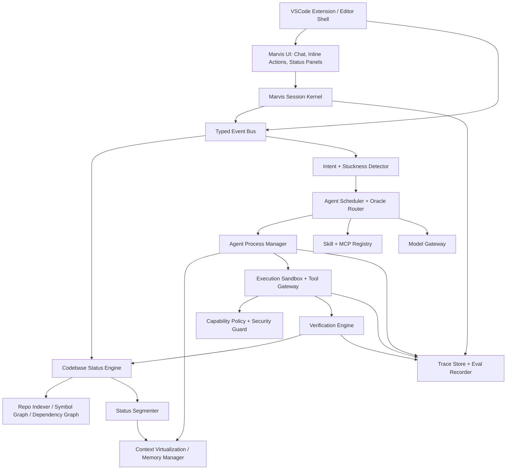
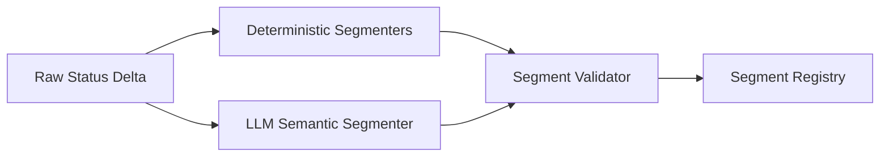
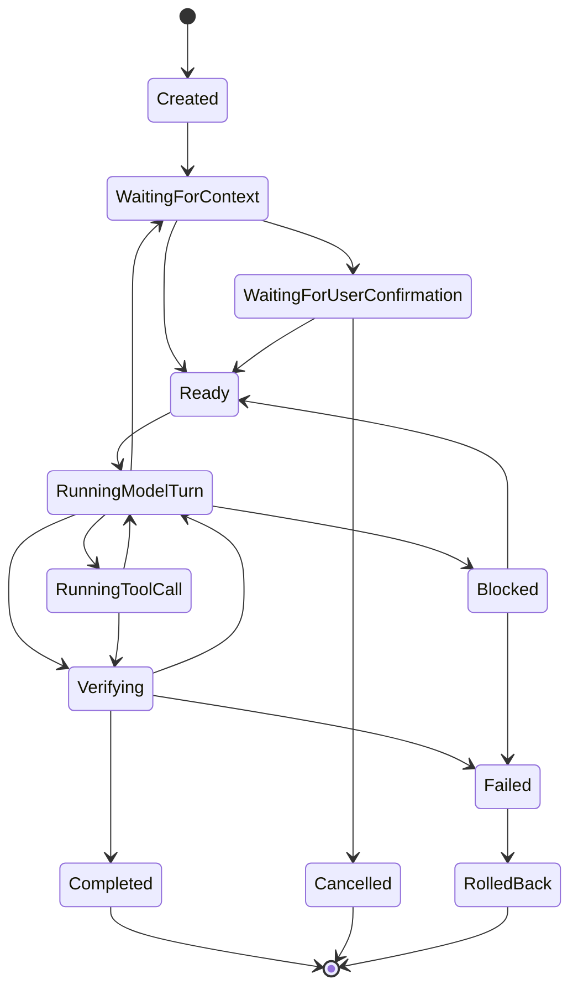

# Marvis Coding Agent OS — Current Execution Plan

**Version:** 1.2  
**Date:** 2026-05-17  
**Primary target:** VSCode plugin as the solitary product target, backed by the Rust runtime in `lite-code`  
**Current repo baseline:** `main` contains `openai-rs`, `protocol`, `rollout`, `thread-store`, `state-store`, `session-kernel`, `scheduler`, and `ui-bridge` crates  
**Design reduction:** from a broad AI OS to a focused coding-agent runtime that can be built in small working slices  
**Core thesis:** Marvis should not be built as “another coding chatbot.” It should be built as a small operating system for coding agents: a runtime that observes the live codebase, represents its status structurally, routes work to the right model/skill/tool, executes bounded turns safely, and improves through evaluation.

---

## 0. Source Idea Consolidation

Your seed idea can be reduced into one strong design sentence:

> **Marvis is an agentic operating system for software work where the codebase is the environment, the session kernel is the CPU/runtime, agent turns are scheduled time quanta, MCP/skills are device drivers, and structural codebase status is the shared memory that gives every model equal access to the project state.**

The important shift is this:

- The original AI OS ambition is too broad for early verification.
- A coding-agent OS is small enough to implement, benchmark, and iterate.
- The VSCode plugin setting is the product, because Marvis needs editor-native state: active editor, cursor position, selections, diagnostics, visible ranges, terminals, tasks, and user navigation.
- The key research object is **structural codebase status**, not merely retrieval, chat history, or file search.
- The key engineering object is a **session kernel** that can coordinate agent processes, context packaging, model turns, user confirmation, tool execution, and verification.

This plan assumes the following existing design intent and current project state:

- Rust is the preferred systems language.
- The only intended product form is a VSCode plugin. The current CLI/web shells are development harnesses for exercising the runtime, not product goals.
- A `session-kernel` crate already exists and should remain the runtime boundary.
- `scheduler` already exists and should own model selection, model turn flow, and future skill routing.
- `ui-bridge` already exists and should become the presentation adapter for VSCode. Its current CLI/web mappings are useful harness code, not the final shell.
- `protocol`, `rollout`, `thread-store`, and `state-store` already exist as neutral local service crates.
- MCPs and oracle skills are near-term substitutes for a richer future learnware system.
- The first verification target should be smaller than a general AI OS and should improve the current vibe-coding loop directly.

### 0.1 Current Project Baseline

The repo is no longer a blank design space. The implementation already has:

- `crates/session-kernel`: `ThreadManager`, `ThreadHandle`, thread lifecycle, submission/event channels, replay/fork shell, and narrow runtime traits.
- `crates/scheduler`: OpenAI-compatible streaming turn execution plus a synthetic scheduler for tests.
- `crates/ui-bridge`: event mapping for current CLI/web harnesses; should grow VSCode-facing event adapters next.
- `crates/protocol`: neutral runtime payloads for operations, events, user input, response items, and thread ids.
- `crates/rollout`, `crates/thread-store`, `crates/state-store`: first-pass local persistence and metadata layers.
- `src/main.rs` and `src/web.rs`: temporary frontends that route through `ThreadManager` and `ThreadHandle`.
- Current tools: shell, file read/write/edit, directory listing, text search, and glob find.

So the plan should not start by inventing a new monorepo or replacing these crates. It should extend them in place, one verified VSCode-centered slice at a time.

---

## 1. Product Definition

### 1.1 Product Name

Use the working name:

> **Marvis Coding Agent OS**

Internally, call the runtime:

> **Marvis Kernel**

The VSCode plugin is the product surface around the kernel. CLI/web may remain as local debug harnesses, but they should not drive product decisions.

### 1.2 One-Sentence Product Description

Marvis is a VSCode-native vibe-coding operating system for coding agents that models live editor and codebase state, detects developer intent and friction, schedules bounded model/tool turns, asks for confirmation when appropriate, executes patches safely, and evaluates itself against real software tasks.

### 1.3 What Makes It Different

Most coding agents follow this loop:

```text
User prompt -> retrieve files -> model plans -> model edits -> run tests -> repeat
```

Marvis should follow this loop:

```text
User prompt/codebase event -> update structural status -> segment status -> infer intent/friction -> schedule thread/process -> package context -> select model/skill/tool -> bounded execution -> verify -> update status -> learn routing policy
```

The difference is that Marvis treats coding work as a managed runtime problem, not only as prompt engineering.

### 1.4 Initial User Experience

The user should experience Marvis as a quiet, context-aware coding partner inside VSCode.

Examples:

1. The user repeatedly edits a broken function. Marvis detects local stuckness, builds a minimal context capsule, and says:

   > “This failure seems centered on `auth/session.rs` and the failing `refresh_token_rotates` test. I can inspect the dependency path and propose a patch.”

2. The user opens a large unfamiliar repository in VSCode. Marvis observes the workspace, open editors, cursor location, visible files, and Problems panel, then builds a structural map and says:

   > “I mapped the repo into 9 subsystems. The request-handling path is `api -> service -> repository -> db`. Ask me to trace a behavior or modify a module.”

3. The user asks for a change. Marvis does not dump a generic plan. It creates a task capsule, asks for confirmation if the risk is non-trivial, executes under a bounded turn budget, runs tests, and reports a verified diff.

4. The user is vibe coding in a live repo. Marvis uses cursor position, selected text, visible ranges, recent edits, and terminal output to keep turns short, use tools quickly, verify often, and report what changed in plain language.

5. The user does nothing but the codebase state changes. Marvis updates status in the background and avoids interrupting unless it detects high-confidence useful assistance.

---

## 2. Design Principles

### 2.1 OS Before Agent

Build abstractions that would still make sense if the model were replaced.

Avoid hard-coding the system around a single LLM provider, prompt, IDE, benchmark, or execution strategy.

### 2.2 Status Before Memory

The central state is not chat memory. It is **codebase status**:

- current files,
- dependency graph,
- symbols,
- diagnostics,
- test state,
- git state,
- recent user actions,
- open buffers,
- runtime errors,
- failing commands,
- active goals,
- risk zones,
- known unresolved issues.

Chat history is only one input.

### 2.3 Segmentation Before Retrieval

Do not retrieve arbitrary chunks first. First classify the live codebase status into semantically meaningful segments:

- failing test segment,
- touched files segment,
- dependency slice segment,
- API contract segment,
- generated code segment,
- high-risk config segment,
- build failure segment,
- user-focus segment,
- long-term project memory segment.

Retrieval should be downstream of segmentation.

### 2.4 Bounded Turns Before Autonomous Loops

Every model action runs inside a budget:

- token budget,
- wall-clock budget,
- tool-call budget,
- file-write budget,
- risk budget,
- user-confirmation budget.

This is the meaning of **timer execution** in the coding-agent OS.

### 2.5 User Consent Is a Scheduling Primitive

Confirmation is not a UI afterthought. It is part of the scheduler. Marvis should decide whether a process can:

- observe silently,
- suggest,
- ask confirmation,
- execute in sandbox,
- edit working tree,
- run commands,
- open network,
- commit changes.

### 2.6 Evaluation Is a First-Class Subsystem

The runtime should be benchmarkable from the start. Every agent process should emit traces that can be replayed in offline benchmarks.

---

## 3. OS-to-Coding-Agent Mapping

| Operating System Concept | Marvis Coding-Agent Equivalent | Implementation Meaning |
|---|---|---|
| Kernel | Session kernel | Rust runtime that owns thread/process lifecycle, state, permissions, events, and traces; delegates route policy to `scheduler`. |
| CPU core | Model execution lane | One active model turn at a time per lane. Multiple lanes can run concurrently if conflict-free. |
| Process | Agent task/process | A managed unit of coding work with PID, lifecycle, priority, budget, model, skills, and context capsule. |
| Thread | Sub-agent turn or tool sequence | Smaller unit within a process, usually a model message or tool call. |
| Time quantum | One bounded model turn | “One turn of one model at one time for one core.” |
| Scheduler | Task segmenter + oracle router | Chooses which process runs next, which model/skill/MCP it uses, and what context it receives. |
| Memory | Context/memory hierarchy | Hot context, working-set context, repo graph, long-term project memory, traces. |
| Virtual memory | Context virtualization | Large codebase becomes addressable symbolic/semantic segments instead of raw token stuffing. |
| Page table | Segment registry | Maps semantic codebase segments to files, symbols, diagnostics, embeddings, and freshness. |
| Page fault | Missing context request | Agent asks for context not currently loaded; kernel fetches/constructs it. |
| Environment variables | Structural codebase status | Shared status snapshot available to all agents in segmented form. |
| Filesystem | Repository + index | Files, git state, dependency graph, symbol index, generated artifacts. |
| Syscall | Tool invocation | Controlled calls to shell, file edit, tests, formatter, LSP, MCP, browser, package manager. |
| Device driver | MCP/skill adapter | Standardized integration layer for external tools and specialized capabilities. |
| Interrupt | IDE/codebase event | File save, diagnostic change, failing test, user pause, command failure, git diff change. |
| Signal | Control message | Stop, pause, ask user, escalate, replan, rollback, compact context. |
| Daemon | Background monitor | Watches diagnostics, tests, git, open files, repeated failures, dependency changes. |
| Package manager | Skill registry | Installs/enables/disables skills, MCPs, model adapters, repo-specific procedures. |
| Permissions | Capability policy | Controls write access, shell access, network, secrets, git operations, risky commands. |
| Sandbox | Isolated execution environment | Runs tests, commands, patch attempts, benchmark tasks. |
| Process table | Agent registry | Tracks all active, paused, completed, failed, and blocked agent processes. |
| Logs | Trace store | Structured event log for replay, evaluation, debugging, and learning. |
| Boot sequence | Workspace initialization | Load repo, index symbols, inspect git, start watchers, build initial status. |
| Shell | VSCode extension | User-facing interface for launching processes, reading live editor state, and receiving status. |
| Init system | Workspace policy loader | Loads `.marvis/` config, skills, permissions, repo profiles, eval settings. |
| IPC | Event bus/blackboard | Components communicate via typed events and shared state snapshots. |
| Kernel panic | Fatal runtime failure | Safe shutdown, trace preservation, no uncommitted destructive changes. |

This table should be treated as the conceptual contract for the entire implementation.

---

## 4. System Objectives

### 4.1 Research Objectives

Marvis should verify the following ideas:

1. **Structural codebase status can improve coding-agent reliability.**
2. **Segmented status can provide fairer and more systematic model access to codebase state than ad hoc retrieval.**
3. **Scheduling model/skill/tool turns as OS-like processes improves safety, observability, and benchmarkability.**
4. **Proactive help can be useful if driven by live codebase state, user behavior, and confirmation policy.**
5. **A small coding-agent OS can serve as an experimental substrate for future learnware and multi-agent reinforcement learning.**

### 4.2 Product Objectives

The first usable version should:

- index a repository,
- understand the live VSCode working set: active editor, cursor, selection, visible ranges, open editors, Problems panel, terminal/task state, and git state,
- detect user intent or stuckness,
- map codebase status into structured segments,
- create a task capsule from user or codebase events,
- select an appropriate model/skill/tool route,
- ask for confirmation when risk requires it,
- execute edits and commands safely,
- verify with tests/diagnostics,
- summarize the result,
- preserve traces for benchmark replay.

### 4.3 Non-Goals for Version 1

Do **not** attempt these initially:

- a full general-purpose AI OS,
- arbitrary multi-agent social simulation,
- unsupervised autonomous repository rewriting,
- self-modifying kernel logic,
- broad cloud deployment,
- full RL training loop,
- automatic installation of arbitrary untrusted MCP servers,
- marketplace of skills,
- collaborative multi-user editing,
- full replacement of the IDE.

---

## 5. Architecture Overview

### 5.1 Top-Level Architecture



### 5.2 Runtime Layers

Marvis should be implemented as layers, using the crates that already exist:

1. **Shell Layer**
   - product target: VSCode extension.
   - current CLI/web code in `src/main.rs`, `src/web.rs`, and `static/` is a runtime harness.
   - VSCode owns editor events, inline suggestions, panels, commands, terminal/task hooks, and confirmation UI.
2. **Kernel Layer**
   - current: `session-kernel`
   - owns thread lifecycle, active turn state, submissions, events, history mutation, replay/fork shell.
3. **Status Layer**
   - next crate to add: codebase model, segment registry, live diagnostics.
4. **Agent Layer**
   - initially implemented through `scheduler` and `session-kernel`; split only when it becomes large.
5. **Tool Layer**
   - current: local tools in `src/tools.rs`
   - next: move stable tool gateway code into a crate once policy/trace behavior is clear.
6. **Verification Layer**
   - tests, build, lint, typecheck, semantic diff, rollback.
7. **Evaluation Layer**
   - traces, replay harness, benchmarks, metrics.

### 5.3 Recommended Repository Layout

```text
lite-code/
  crates/
    openai-rs/          # OpenAI-compatible client, already present
    protocol/           # runtime-neutral ops/events/thread ids, already present
    rollout/            # JSONL transcript persistence, already present
    thread-store/       # thread persistence boundary, already present
    state-store/        # local metadata store shell, already present
    session-kernel/     # live thread/session runtime, already present
    scheduler/          # model turn flow and future route policy, already present
    ui-bridge/          # current CLI/web harness adapters; next VSCode event adapters

    status/             # next: CodebaseStatus, StatusDelta, segment registry
    context/            # next: context capsules and compaction, after status exists
    tools-gateway/      # later: policy-wrapped tools moved out of src/tools.rs
    verifier/           # later: test/build/format verification and rollback
    eval-harness/       # later: traces, replay, golden tasks

  apps/
    vscode-extension/   # solitary product shell: editor events, panels, commands, extension host bridge

  src/
    main.rs             # temporary CLI harness, already uses ThreadManager
    web.rs              # temporary web/SSE harness, already uses ThreadHandle events
    tools.rs            # current local tool executor, keep until tool gateway hardens

  static/               # current web harness UI
  docs/                 # provenance and architecture docs
  benches/              # future local golden tasks and traces
  .marvis/              # future repo profile, policies, skills
```

Do not create `marvis-*` crates just for naming symmetry. Add a crate only when the code has a clear owner and the current crates would become confusing.

---

## 6. Core Data Model

The system should be implemented around explicit data structures. Avoid letting prompts become the only schema.

### 6.1 Kernel Types

In the current repo, the kernel API is not a single `Kernel` object yet. It is exposed through `ThreadManager` and `ThreadHandle`. Keep that API shape and add process/status concepts behind it.

```rust
pub struct ThreadManager {
    // already exists in session-kernel
    // owns live ThreadHandle instances and creates/resumes/forks threads
}

pub struct ThreadHandle {
    // already exists in session-kernel
    // owns submit, next_event, steer_input, inject_response_items, config_snapshot
}

pub struct RuntimeServices {
    pub status_store: StatusStore,
    pub context_manager: ContextManager,
    pub tool_gateway: ToolGateway,
    pub policy_engine: PolicyEngine,
    pub trace_store: TraceStore,
}
```

`RuntimeServices` should be introduced gradually. Do not recreate a giant dependency bucket. Add one service only when a real thread flow uses it.

### 6.2 Codebase Status

```rust
pub struct CodebaseStatus {
    pub workspace: WorkspaceMeta,
    pub timestamp: DateTime<Utc>,
    pub repo_graph: RepoGraph,
    pub symbol_graph: SymbolGraph,
    pub dependency_graph: DependencyGraph,
    pub git_state: GitState,
    pub diagnostics: Vec<DiagnosticEvent>,
    pub test_state: TestState,
    pub build_state: BuildState,
    pub open_buffers: Vec<OpenBufferState>,
    pub recent_user_activity: UserActivityWindow,
    pub active_errors: Vec<RuntimeOrBuildError>,
    pub risk_map: RiskMap,
    pub task_history: Vec<TaskSummary>,
    pub segment_registry: SegmentRegistry,
}
```

### 6.3 Status Segment

```rust
pub struct StatusSegment {
    pub id: SegmentId,
    pub kind: SegmentKind,
    pub scope: SegmentScope,
    pub summary: String,
    pub evidence: Vec<EvidenceRef>,
    pub files: Vec<PathBuf>,
    pub symbols: Vec<SymbolId>,
    pub diagnostics: Vec<DiagnosticId>,
    pub token_estimate: usize,
    pub freshness: Freshness,
    pub confidence: f32,
    pub importance: f32,
    pub risk_level: RiskLevel,
    pub owners: Vec<ComponentOwner>,
}
```

```rust
pub enum SegmentKind {
    UserFocus,
    RecentDiff,
    FailingTest,
    BuildFailure,
    DiagnosticCluster,
    DependencySlice,
    ApiContract,
    DataModel,
    Config,
    GeneratedCode,
    SecuritySensitive,
    PerformanceHotPath,
    TestCoverageGap,
    Documentation,
    Unknown,
}
```

### 6.4 Task Capsule

A task capsule is the unit that turns status into executable work.

```rust
pub struct TaskCapsule {
    pub id: TaskId,
    pub origin: TaskOrigin,
    pub user_intent: Option<UserIntent>,
    pub inferred_goal: Goal,
    pub problem_statement: String,
    pub acceptance_criteria: Vec<AcceptanceCriterion>,
    pub constraints: Vec<TaskConstraint>,
    pub relevant_segments: Vec<SegmentId>,
    pub context_requirements: ContextRequirements,
    pub proposed_plan: Option<Plan>,
    pub risk_level: RiskLevel,
    pub requires_confirmation: bool,
}
```

```rust
pub enum TaskOrigin {
    ExplicitUserRequest,
    DiagnosticChange,
    TestFailure,
    BuildFailure,
    RepeatedEditPattern,
    UserPause,
    GitDiffChange,
    BenchmarkHarness,
    ScheduledMaintenance,
}
```

### 6.5 Agent Process

```rust
pub struct AgentProcess {
    pub pid: ProcessId,
    pub parent: Option<ProcessId>,
    pub task: TaskCapsule,
    pub state: ProcessState,
    pub priority: Priority,
    pub budget: ProcessBudget,
    pub route: ExecutionRoute,
    pub context_capsule: ContextCapsule,
    pub permissions: CapabilitySet,
    pub trace_id: TraceId,
    pub created_at: DateTime<Utc>,
    pub updated_at: DateTime<Utc>,
}
```

```rust
pub enum ProcessState {
    Created,
    WaitingForContext,
    WaitingForUserConfirmation,
    Ready,
    RunningModelTurn,
    RunningToolCall,
    Verifying,
    Blocked,
    Completed,
    Failed,
    Cancelled,
    RolledBack,
}
```

### 6.6 Execution Route

```rust
pub struct ExecutionRoute {
    pub model: ModelId,
    pub fallback_models: Vec<ModelId>,
    pub skills: Vec<SkillId>,
    pub mcp_servers: Vec<McpServerId>,
    pub planner_mode: PlannerMode,
    pub executor_mode: ExecutorMode,
    pub verifier_mode: VerifierMode,
}
```

### 6.7 Skill Descriptor

Skills should be treated as learnware-like executable capabilities.

```rust
pub struct SkillDescriptor {
    pub id: SkillId,
    pub name: String,
    pub description: String,
    pub input_contract: JsonSchema,
    pub output_contract: JsonSchema,
    pub capabilities: CapabilitySet,
    pub domains: Vec<SkillDomain>,
    pub cost_profile: CostProfile,
    pub reliability_score: ReliabilityScore,
    pub examples: Vec<SkillExample>,
    pub safety_notes: Vec<String>,
}
```

### 6.8 Event Type

Everything interesting should be an event.

```rust
pub enum KernelEvent {
    WorkspaceOpened(WorkspaceId),
    FileChanged(FileChangeEvent),
    BufferFocused(BufferFocusEvent),
    DiagnosticsUpdated(Vec<DiagnosticEvent>),
    TestRunCompleted(TestRunResult),
    BuildCompleted(BuildResult),
    GitDiffChanged(GitDiffSummary),
    UserPromptReceived(UserPrompt),
    UserIdle(UserIdleEvent),
    StatusSegmented(Vec<StatusSegment>),
    IntentInferred(IntentInference),
    ProcessCreated(ProcessId),
    ProcessStateChanged(ProcessId, ProcessState),
    ModelTurnStarted(ProcessId),
    ModelTurnCompleted(ProcessId),
    ToolCallRequested(ToolCallRequest),
    ToolCallCompleted(ToolCallResult),
    VerificationCompleted(VerificationResult),
    UserConfirmationRequested(ConfirmationRequest),
    UserConfirmationReceived(ConfirmationResponse),
    ProcessCompleted(ProcessId),
    ProcessFailed(ProcessId, FailureReason),
}
```

---

## 7. The Central Design Object: Structural Codebase Status

### 7.1 Definition

**Structural codebase status** is a normalized, segmented, continuously updated representation of the repository and the user's interaction with it.

It is not merely:

- a vector database,
- a file tree,
- chat history,
- LSP diagnostics,
- git diff,
- test output.

It is the fusion of all of them into a kernel-readable state.

### 7.2 Required Status Inputs

| Input | Source | Update Trigger | Use |
|---|---|---|---|
| File tree | Filesystem watcher | File create/delete/rename | Repo topology |
| Open buffers | VSCode | Focus, edit, save | User attention |
| Active editor | VSCode | Editor focus change | Primary work target |
| Cursor/selection | VSCode | Cursor movement, selection change | Local intent |
| Visible ranges | VSCode | Scroll, split editor, notebook/editor layout change | What the user can currently see |
| Hover/peek/definition usage | VSCode | Peek definition, go-to-definition, hover | What the user is investigating |
| Problems panel | VSCode diagnostics | Diagnostic event | Error clusters and user-visible failures |
| Integrated terminal | VSCode terminal | Command start/end, output chunks | Build/test/failure state |
| Tasks/debug sessions | VSCode tasks/debug API | Task/debug start/end | Verification and runtime failure state |
| Workspace trust/profile | VSCode | Workspace load/profile change | Permission defaults |
| Recent edits | VSCode/git diff | Text changes | Work-in-progress state |
| Symbol index | LSP/tree-sitter | File save/index refresh | Semantic navigation |
| Dependency graph | Language tooling/static analysis | Build/index refresh | Impact analysis |
| Diagnostics | LSP/compiler/linter | Diagnostic event | Error clusters |
| Test results | Test runner | Test run completion | Verification |
| Build results | Build system | Build completion | Failure state |
| Git state | Git | Diff/branch/status event | Change management |
| Command history | Tool gateway | Command completion | Repeated failure/stuckness |
| User prompts | UI | Prompt submit | Explicit intent |
| Agent traces | Trace store | Process event | Learning/eval/replay |
| Repo config | `.marvis/` | Workspace load | Policy and preferences |

### 7.2.1 VSCode Status Model

The VSCode plugin must treat editor state as first-class status, not decoration around chat.

Marvis should maintain a `VscodeStatus` slice inside `CodebaseStatus`:

```rust
pub struct VscodeStatus {
    pub active_editor: Option<EditorRef>,
    pub open_editors: Vec<EditorRef>,
    pub visible_ranges: Vec<VisibleRange>,
    pub selections: Vec<SelectionState>,
    pub cursor_context: Option<CursorContext>,
    pub recently_opened_files: Vec<PathBuf>,
    pub recently_saved_files: Vec<PathBuf>,
    pub problems: Vec<DiagnosticEvent>,
    pub terminal_sessions: Vec<TerminalSessionState>,
    pub running_tasks: Vec<VscodeTaskState>,
    pub debug_sessions: Vec<DebugSessionState>,
    pub clipboard_hint: Option<ClipboardHint>,
}
```

Creative but useful VSCode-specific signals:

- **Attention stack:** last N files the user looked at, weighted by dwell time, cursor movement, and edits.
- **Cursor bubble:** symbols, imports, tests, diagnostics, and comments within a small range around the cursor.
- **Visible context:** code currently visible in split editors, not just the active file.
- **Navigation trail:** go-to-definition, peek references, and back/forward jumps as evidence of what the user is trying to understand.
- **Terminal failure memory:** recent failing commands in integrated terminals, grouped by repeated error signatures.
- **Debug pressure:** breakpoints, stopped stack frame, watched variables, and debug console errors.
- **Edit rhythm:** bursts of edits, undo loops, repeated saves, and switching between test and implementation files.
- **Trust mode:** workspace trust, remote SSH/container state, and restricted mode should affect tool permissions.

This is why the VSCode plugin is the solitary goal: without these signals, Marvis cannot build the strongest version of structural codebase status.

### 7.3 Status Normalization

Create a normalizer per signal source.

Examples:

```rust
trait StatusNormalizer<Input> {
    fn normalize(&self, input: Input, previous: &CodebaseStatus) -> StatusDelta;
}
```

Each `StatusDelta` should be composable:

```rust
pub struct StatusDelta {
    pub timestamp: DateTime<Utc>,
    pub source: StatusSource,
    pub affected_files: Vec<PathBuf>,
    pub affected_symbols: Vec<SymbolId>,
    pub diagnostics_added: Vec<DiagnosticEvent>,
    pub diagnostics_removed: Vec<DiagnosticId>,
    pub git_delta: Option<GitDelta>,
    pub test_delta: Option<TestDelta>,
    pub user_activity_delta: Option<UserActivityDelta>,
}
```

### 7.4 Segment Registry

The segment registry is the equivalent of the page table.

```rust
pub struct SegmentRegistry {
    pub segments: HashMap<SegmentId, StatusSegment>,
    pub file_to_segments: HashMap<PathBuf, Vec<SegmentId>>,
    pub symbol_to_segments: HashMap<SymbolId, Vec<SegmentId>>,
    pub diagnostic_to_segments: HashMap<DiagnosticId, Vec<SegmentId>>,
    pub active_segment_ids: Vec<SegmentId>,
}
```

### 7.5 Segment Freshness Policy

Each segment has a freshness state:

```rust
pub enum Freshness {
    Hot,       // updated within current user activity window
    Warm,      // probably relevant but not in focus
    Cold,      // stable background knowledge
    Stale,     // invalidated by recent changes
    Unknown,
}
```

Segment freshness determines context priority.

### 7.6 Example Status Snapshot

```yaml
workspace:
  language_primary: Rust
  branch: main
  dirty_files:
    - crates/session-kernel/src/lib.rs
    - crates/scheduler/src/lib.rs

active_segments:
  - id: seg_user_focus_001
    kind: UserFocus
    summary: User is editing thread scheduling and turn execution logic.
    files:
      - crates/scheduler/src/lib.rs
    freshness: Hot
    importance: 0.95

  - id: seg_diagnostic_014
    kind: DiagnosticCluster
    summary: Borrow checker errors caused by mutable process table access during route selection.
    files:
      - crates/session-kernel/src/lib.rs
      - crates/scheduler/src/lib.rs
    freshness: Hot
    importance: 0.92

  - id: seg_dependency_007
    kind: DependencySlice
    summary: Scheduler depends on TurnRequest, EventEmitter, ToolExecutor, and protocol event types.
    files:
      - crates/scheduler/src/lib.rs
      - crates/session-kernel/src/lib.rs
      - crates/protocol/src/lib.rs
    freshness: Warm
    importance: 0.78
```

---

## 8. Status Segmentation Engine

### 8.1 Purpose

The segmentation engine converts a raw status snapshot into agent-usable semantic slices.

This is the first major research component.

### 8.2 Inputs

- `CodebaseStatus`
- `StatusDelta`
- recent user activity window
- current active task if any
- model/tool budget constraints
- language ecosystem profile
- `.marvis/repo_profile.toml`

### 8.3 Outputs

- updated `SegmentRegistry`
- active segment ranking
- invalidated segments
- suggested task capsules
- status summary for the user-facing UI

### 8.4 Segmenter Architecture

Use a hybrid approach:

1. **Deterministic segmenters**
   - file diff segmenter,
   - diagnostic clusterer,
   - dependency slicer,
   - test failure mapper,
   - symbol ownership mapper,
   - risk classifier.

2. **LLM segmenter**
   - merges weak signals,
   - names segments,
   - summarizes intent,
   - detects ambiguous task boundaries,
   - classifies human-relevant meaning.

3. **Validator**
   - checks that segment references exist,
   - verifies files/symbols/diagnostics,
   - rejects hallucinated paths,
   - assigns confidence.



### 8.5 Segmenter Algorithm

```text
On StatusDelta:
  1. Identify affected files, symbols, diagnostics, tests, and git hunks.
  2. Invalidate old segments overlapping affected regions.
  3. Run deterministic segmenters:
     a. RecentDiffSegmenter
     b. DiagnosticClusterSegmenter
     c. TestFailureSegmenter
     d. DependencySliceSegmenter
     e. UserFocusSegmenter
     f. RiskSegmenter
  4. Create candidate segments.
  5. If candidate ambiguity > threshold, call LLM segmenter.
  6. Ask LLM to:
     a. merge related candidate segments,
     b. name user-relevant problems,
     c. identify likely developer goal,
     d. rank segment importance.
  7. Validate references.
  8. Update SegmentRegistry.
  9. Emit StatusSegmented event.
```

### 8.6 Segmenter Prompt Contract

The LLM segmenter must operate under a strict output schema.

```text
SYSTEM:
You segment a live software repository status snapshot into semantic units useful for coding agents.
You must not invent files, symbols, diagnostics, tests, or commands.
Use only provided evidence IDs.
Return valid JSON matching the schema.

INPUT:
- workspace summary
- recent user activity
- changed files
- diagnostics
- failing tests
- deterministic candidate segments
- dependency graph excerpt

OUTPUT:
{
  "segments": [
    {
      "kind": "...",
      "summary": "...",
      "evidence_ids": ["..."],
      "file_paths": ["..."],
      "symbol_ids": ["..."],
      "diagnostic_ids": ["..."],
      "importance": 0.0-1.0,
      "confidence": 0.0-1.0,
      "risk_level": "low|medium|high|critical"
    }
  ],
  "possible_user_intents": [
    {
      "intent": "...",
      "confidence": 0.0-1.0,
      "supporting_segment_ids": ["..."]
    }
  ],
  "proactive_suggestions": [
    {
      "message": "...",
      "action_type": "suggest|ask|execute_after_confirmation",
      "confidence": 0.0-1.0
    }
  ]
}
```

### 8.7 Segment Validation Rules

Reject or repair any LLM segment if:

- file path does not exist,
- symbol ID does not exist,
- diagnostic ID does not exist,
- confidence is unsupported by evidence,
- segment overlaps generated code but is not marked generated,
- risk level is lower than deterministic risk classifier,
- summary references non-existent user intent,
- segment token estimate exceeds configured maximum.

---

## 9. Intent and Stuckness Detection

### 9.1 Explicit Intent

Explicit intent comes from user prompts:

```text
"Fix this test"
"Implement caching"
"Explain this module"
"Refactor this function"
"Why is this failing?"
```

Classify explicit intent into:

```rust
pub enum IntentKind {
    Explain,
    Search,
    Debug,
    Fix,
    Implement,
    Refactor,
    Test,
    Review,
    Optimize,
    Migrate,
    Document,
    Benchmark,
    Unknown,
}
```

### 9.2 Implicit Intent

Implicit intent is inferred from IDE behavior:

- repeated edits in same function,
- repeated failed test runs,
- cursor stays on diagnostic,
- user opens multiple related files,
- user undoes/reverts repeatedly,
- terminal command fails repeatedly,
- user pauses after a failure,
- user switches between implementation and tests,
- user creates TODO comments,
- user inspects unfamiliar dependency chain.

### 9.3 Stuckness Signal

```rust
pub struct StucknessSignal {
    pub score: f32,
    pub evidence: Vec<StucknessEvidence>,
    pub likely_problem: Option<String>,
    pub suggested_intervention: InterventionType,
}
```

```rust
pub enum StucknessEvidence {
    SameDiagnosticRepeated { diagnostic_id: DiagnosticId, count: usize },
    SameTestFailedRepeatedly { test_name: String, count: usize },
    EditUndoLoop { file: PathBuf, count: usize },
    LongIdleOnError { duration_secs: u64 },
    TerminalFailureLoop { command_pattern: String, count: usize },
    OpenedRelatedFiles { files: Vec<PathBuf> },
}
```

### 9.4 Proactive Assistance Policy

Marvis should not interrupt aggressively.

Use thresholds:

| Stuckness Score | Action |
|---:|---|
| 0.00–0.39 | Observe silently |
| 0.40–0.59 | Update passive status panel |
| 0.60–0.74 | Show low-priority suggestion |
| 0.75–0.89 | Ask if user wants help |
| 0.90–1.00 | Ask with specific proposed action |

Example:

```text
I noticed `cargo test scheduler` has failed 3 times with the same borrow error.
I can inspect the ownership path and propose a minimal patch.
```

### 9.5 Intent-to-Task Conversion

When intent confidence is high:

```text
StatusSegmented + IntentInferred -> TaskCapsule
```

When intent confidence is medium:

```text
StatusSegmented + IntentInferred -> UserConfirmationRequest
```

When intent confidence is low:

```text
StatusSegmented -> passive status only
```

---

## 10. Scheduler and Oracle Routing

### 10.1 Scheduler Responsibility

The scheduler decides:

- whether to create a process,
- which process runs,
- which context it receives,
- which model it uses,
- which skills/MCPs are allowed,
- whether user confirmation is required,
- how much budget is allocated,
- when to stop, pause, replan, or escalate.

### 10.2 Process Priority

```rust
pub enum PriorityClass {
    UserBlocking,       // explicit request or active failure
    ActiveAssistance,   // high-confidence stuckness
    Verification,       // tests/build after edits
    BackgroundAnalysis, // index, summarize, update segments
    Maintenance,        // cache compaction, trace cleanup
}
```

Priority score:

```text
priority =
  user_explicitness * 0.30
+ current_focus_overlap * 0.20
+ failure_severity * 0.20
+ confidence * 0.15
+ expected_value * 0.10
- estimated_cost * 0.05
```

### 10.3 Model/Skill Routing

Route selection should use a transparent scoring system.

```text
route_score =
  capability_match * 0.30
+ context_fit * 0.15
+ language_fit * 0.15
+ skill_reliability * 0.15
+ expected_quality * 0.15
- expected_cost * 0.05
- latency_penalty * 0.05
```

### 10.4 Route Examples

| Task | Preferred Route |
|---|---|
| Simple explanation | cheap/fast model + repo context capsule |
| Rust borrow checker fix | strong coding model + Rust compiler diagnostics + edit skill |
| Test failure triage | planner model + test runner + dependency slice |
| Large refactor | planner model + reviewer model + semantic diff verifier |
| UI bug with screenshot | multimodal model + frontend skill + browser/test runner |
| Dependency upgrade | package-manager skill + changelog MCP + test verifier |
| Security-sensitive change | high-reasoning model + restricted tools + mandatory confirmation |

### 10.5 Scheduling Loop

```text
while kernel_running:
  events = event_bus.poll()
  status_store.apply(events)
  new_segments = segmenter.update(status_store.snapshot())

  intent = intent_detector.infer(new_segments, user_activity)
  maybe_task = task_factory.create(intent, new_segments)

  if maybe_task:
    process = process_manager.spawn(maybe_task)
    scheduler.enqueue(process)

  process = scheduler.next_ready_process()
  if process.requires_confirmation:
    ask_user(process.confirmation_request)
    continue

  context = context_manager.build_capsule(process.task)
  route = router.select(context, process.task)
  process.assign(context, route)

  result = agent_runner.run_one_quantum(process)
  verifier.check(result)

  status_store.apply(result.status_delta)
  trace_store.record(result)
```

### 10.6 Multi-Core Execution

“Multiple cores” means multiple model execution lanes. But concurrent edits are dangerous.

Rules:

- multiple read-only analysis processes can run concurrently;
- only one write process can edit a file at a time;
- write processes must lock affected files;
- verification processes can run concurrently if they use isolated worktrees;
- background indexing must yield to user-blocking tasks;
- if two processes target overlapping segments, scheduler must merge, serialize, or cancel one.

```rust
pub struct FileLock {
    pub file: PathBuf,
    pub owner_pid: ProcessId,
    pub mode: LockMode, // Read, Write
}
```

---

## 11. Context Virtualization

### 11.1 Context Problem

A repository is too large for direct model context. Marvis should avoid stuffing arbitrary chunks.

Instead:

- each task gets a **context capsule**;
- the capsule contains ranked, validated, bounded context;
- missing context is requested through page-fault-like mechanisms.

### 11.2 Memory Tiers

| Tier | Name | Contents | Latency | Use |
|---|---|---|---|---|
| L0 | Prompt-local context | Current task capsule | Immediate | Model turn |
| L1 | Hot working set | open buffers, current diff, active diagnostics | Very low | Active work |
| L2 | Warm structural context | segments, dependency slices, symbol graph | Low | Reasoning |
| L3 | Cold repo memory | repo summaries, docs, historical traces | Medium | Broader context |
| L4 | External context | MCPs, web/docs/package metadata | High | Specialized tasks |

### 11.3 Context Capsule

```rust
pub struct ContextCapsule {
    pub task_id: TaskId,
    pub system_contract: String,
    pub user_goal: String,
    pub acceptance_criteria: Vec<String>,
    pub active_segments: Vec<SerializedSegment>,
    pub files: Vec<FileContext>,
    pub diagnostics: Vec<DiagnosticContext>,
    pub tests: Vec<TestContext>,
    pub dependency_slices: Vec<DependencySlice>,
    pub git_diff: Option<String>,
    pub tool_instructions: Vec<ToolInstruction>,
    pub safety_constraints: Vec<String>,
    pub budget: ContextBudget,
}
```

### 11.4 Context Assembly Algorithm

```text
BuildContextCapsule(task):
  1. Start with task goal and acceptance criteria.
  2. Add hot user-focus segment.
  3. Add directly referenced files/symbols.
  4. Add diagnostics/failing tests linked to those symbols.
  5. Add dependency slices up to depth N.
  6. Add current git diff if relevant.
  7. Add repo conventions from `.marvis/` or detected style.
  8. Add tool contracts and allowed capabilities.
  9. Fit to token budget:
     a. keep exact code for hot files,
     b. summarize warm files,
     c. include symbol signatures for cold dependencies,
     d. drop unsupported or low-confidence segments.
  10. Return capsule with provenance.
```

### 11.5 Page Faults

If the model needs more context, it should not hallucinate. It should request a page fault:

```json
{
  "type": "context_request",
  "reason": "Need definition of TurnRequest to understand scheduler input",
  "requested_symbol": "TurnRequest",
  "requested_file": "crates/session-kernel/src/lib.rs"
}
```

The kernel resolves it:

```text
Agent -> PageFault -> ContextManager -> SegmentRegistry/Index -> AddContext -> ResumeProcess
```

### 11.6 Context Compaction

After each model turn, compact:

- decisions,
- changed files,
- failed hypotheses,
- successful commands,
- unresolved blockers,
- next action.

Do not keep raw long chat forever.

```rust
pub struct TurnSummary {
    pub pid: ProcessId,
    pub decision: String,
    pub actions_taken: Vec<ActionSummary>,
    pub files_changed: Vec<PathBuf>,
    pub tests_run: Vec<TestRunSummary>,
    pub errors: Vec<String>,
    pub next_step: Option<String>,
}
```

---

## 12. Agent Process Lifecycle

### 12.1 Lifecycle Diagram



### 12.2 Process Creation

A process may be created by:

- explicit user request,
- high-confidence inferred stuckness,
- failing test,
- benchmark harness,
- internal maintenance task.

### 12.3 Process Budget

```rust
pub struct ProcessBudget {
    pub max_model_turns: u32,
    pub max_tool_calls: u32,
    pub max_wall_time_secs: u64,
    pub max_tokens_input: usize,
    pub max_tokens_output: usize,
    pub max_cost_usd: Option<f32>,
    pub max_files_changed: usize,
    pub max_risk_level: RiskLevel,
}
```

Default budgets:

| Task Type | Model Turns | Tool Calls | Confirmation | Write Access |
|---|---:|---:|---|---|
| Explain | 1–2 | 0–2 | no | no |
| Triage | 2–4 | 3–8 | maybe | no |
| Small fix | 3–8 | 5–20 | yes before edit | yes |
| Refactor | 5–15 | 10–50 | yes | yes |
| Benchmark task | configurable | configurable | no, sandbox | yes, sandbox |
| Background analysis | 1–3 | 0–5 | no | no |

### 12.4 Process Completion

A process is complete only when it has:

- produced a user-readable summary,
- recorded all changed files,
- run required verification or explained why not,
- updated status,
- emitted trace,
- released locks,
- saved compacted memory.

### 12.5 Failure Handling

Failure categories:

```rust
pub enum FailureReason {
    ContextInsufficient,
    ModelRefused,
    ToolFailed,
    TestFailed,
    BuildFailed,
    PermissionDenied,
    BudgetExceeded,
    UserRejected,
    ConflictDetected,
    HallucinatedReference,
    InternalKernelError,
}
```

Each failure should produce:

- human-readable explanation,
- trace link,
- next possible action,
- rollback status.

---

## 13. Tool Gateway and MCP Layer

### 13.1 Tool Gateway

The tool gateway is the syscall interface.

Tools must be:

- typed,
- permissioned,
- logged,
- cancelable when possible,
- bounded by timeouts,
- validated before and after execution.

```rust
pub trait Tool {
    type Input;
    type Output;

    fn name(&self) -> &'static str;
    fn capabilities(&self) -> CapabilitySet;
    fn risk(&self, input: &Self::Input) -> RiskLevel;
    async fn execute(&self, input: Self::Input, ctx: ToolContext) -> ToolResult<Self::Output>;
}
```

### 13.2 Required Built-In Tools

Current `lite-code` tools:

1. `shell`
2. `read_file`
3. `write_file`
4. `edit_file`
5. `list_directory`
6. `search_files`
7. `find_files`

Next tools to add for the vibe-coding MVP:

1. `apply_patch`
2. `run_test`
3. `run_build`
4. `run_formatter`
5. `git_diff`
6. `git_status`
7. `request_context`
8. `ask_user`

Later tools:

1. `symbol_lookup`
2. `dependency_slice`
3. `run_linter`
4. `git_checkout_file`
5. `create_branch`
6. `open_editor_location`

### 13.3 MCP Integration

MCP should be treated as an external device bus.

Marvis should support:

- MCP client connections,
- server capability discovery,
- tool/resource/prompt listing,
- permission grants per server,
- strict logging of MCP calls,
- allowlist/denylist policy,
- per-workspace MCP config.

### 13.4 MCP Security Rules

Never treat MCP servers as inherently trusted.

Minimum rules:

- no auto-install without explicit user action,
- no unrestricted shell through MCP,
- no secret access unless explicitly permitted,
- no network calls unless capability policy allows,
- all tool descriptions must be shown or inspectable,
- tool output must be considered untrusted input,
- prompt-injection-sensitive outputs must be isolated from policy/system prompts,
- each MCP server receives minimum required context.

### 13.5 MCP Config Example

```toml
# .marvis/mcp.toml

[[servers]]
id = "local-docs"
command = "uvx"
args = ["mcp-server-docs"]
enabled = true

[servers.permissions]
read_workspace = true
write_workspace = false
network = false
shell = false
secrets = false

[[servers]]
id = "github"
command = "npx"
args = ["-y", "@modelcontextprotocol/server-github"]
enabled = false

[servers.permissions]
read_workspace = false
write_workspace = false
network = true
shell = false
secrets = false
```

### 13.6 Skill Registry

The skill registry should unify built-in skills, local repo skills, and MCP-backed skills.

```toml
# .marvis/skills/rust_debugger.toml

id = "rust-debugger"
name = "Rust Debugger"
domains = ["rust", "diagnostics", "tests"]
capabilities = ["read_file", "run_test", "apply_patch"]
risk_level = "medium"

[input]
requires = ["diagnostics", "failing_tests", "relevant_files"]

[output]
produces = ["patch", "explanation", "verification_plan"]
```

---

## 14. Planner, Executor, Critic, Verifier

### 14.1 Why Separate These Roles

A coding task requires different cognitive modes:

- planning,
- editing,
- command execution,
- critique,
- verification,
- summarization.

These can be one model in the current vibe-coding MVP. Keep them as separate runtime concepts, not separate crates or model calls, until traces show that splitting them improves quality.

### 14.2 Planner

Inputs:

- task capsule,
- context capsule,
- allowed tools,
- budget.

Outputs:

- plan steps,
- affected files,
- risk estimate,
- verification plan,
- confirmation request if needed.

Planner JSON:

```json
{
  "goal": "...",
  "hypothesis": "...",
  "steps": [
    {
      "type": "inspect|edit|test|ask_user|finish",
      "description": "...",
      "target_files": ["..."],
      "tools": ["..."]
    }
  ],
  "risk_level": "low|medium|high|critical",
  "requires_confirmation": true,
  "verification_plan": ["cargo test -p session-kernel"]
}
```

### 14.3 Executor

Executor performs bounded actions. It should not freely improvise beyond policy.

Allowed executor actions:

- inspect file,
- request context,
- apply patch,
- run command,
- run tests,
- ask user,
- finish.

Executor loop:

```text
for step in plan:
  if budget exceeded: stop
  if step needs missing context: page fault
  if step is risky: confirm
  execute tool
  update trace
  if tool failed: replan or escalate
```

In the current implementation this loop belongs in `scheduler` first. Move parts into `session-kernel` only if they are truly runtime lifecycle concerns, and move parts into a future `tools-gateway` only when policy and tracing need a stable boundary.

### 14.4 Critic

The critic reviews:

- patch correctness,
- scope creep,
- style consistency,
- test sufficiency,
- missed edge cases,
- hallucinated references,
- risk violations.

The critic should be optional for small tasks and mandatory for high-risk tasks.

### 14.5 Verifier

The verifier is not an LLM by default. Prefer deterministic checks:

- tests,
- build,
- typecheck,
- formatter,
- linter,
- snapshot diff,
- semantic diff,
- risk policy.

LLM verification can supplement deterministic checks but not replace them.

### 14.6 Minimal Fix Loop

```text
Plan -> Confirm -> Edit -> Test -> If fail, inspect failure -> Edit -> Test -> Critic -> Summary
```

Bounded by max turns.

---

## 15. User Confirmation and Interaction Design

### 15.1 Confirmation Levels

| Level | Name | Meaning |
|---:|---|---|
| 0 | Silent observe | No user notification |
| 1 | Passive display | Status panel update |
| 2 | Suggest | Non-blocking suggestion |
| 3 | Ask | “Should I do X?” |
| 4 | Confirm patch | Show planned edits before applying |
| 5 | Confirm command | Required for risky shell/network/git command |
| 6 | Manual only | Marvis cannot execute; user must do it |

### 15.2 Confirmation Request Schema

```rust
pub struct ConfirmationRequest {
    pub process_id: ProcessId,
    pub title: String,
    pub summary: String,
    pub proposed_actions: Vec<ProposedAction>,
    pub affected_files: Vec<PathBuf>,
    pub risk_level: RiskLevel,
    pub alternatives: Vec<String>,
    pub default_choice: ConfirmationChoice,
}
```

### 15.3 Good Confirmation UX

Bad:

```text
Do you want me to continue?
```

Good:

```text
I can patch `scheduler.rs` to avoid holding a mutable borrow while selecting the route.
Affected files: `crates/scheduler/src/lib.rs`, `crates/session-kernel/src/lib.rs`.
Verification: `cargo test -p scheduler && cargo test -p session-kernel`.
Risk: medium.
```

Buttons:

- Apply patch
- Show plan
- Run read-only analysis first
- Cancel

### 15.4 User Control Modes

Support modes:

```toml
[interaction]
mode = "confirm" # observe | suggest | confirm | yolo_sandbox | manual
```

- `observe`: never interrupt, only status panel.
- `suggest`: suggestions only, no edits.
- `confirm`: ask before meaningful action.
- `yolo_sandbox`: execute in isolated worktree, no direct write to main tree.
- `manual`: produce instructions only.

Default should be `confirm`.

---

## 16. Safety and Security

### 16.1 Threat Model

Marvis operates inside source code and can call tools. Threats include:

- malicious repository instructions,
- prompt injection in docs/comments/issues,
- malicious MCP server,
- malicious package scripts,
- shell command injection,
- accidental destructive edits,
- secret leakage,
- network exfiltration,
- benchmark contamination,
- confusing generated code with source of truth.

### 16.2 Capability Model

```rust
bitflags! {
    pub struct Capability: u64 {
        const READ_WORKSPACE = 1 << 0;
        const WRITE_WORKSPACE = 1 << 1;
        const RUN_TESTS = 1 << 2;
        const RUN_BUILD = 1 << 3;
        const RUN_SHELL = 1 << 4;
        const NETWORK = 1 << 5;
        const READ_SECRETS = 1 << 6;
        const GIT_WRITE = 1 << 7;
        const INSTALL_DEPS = 1 << 8;
        const MCP_CALL = 1 << 9;
    }
}
```

### 16.3 Default Policy

Default deny:

- network,
- secrets,
- dependency install,
- destructive shell commands,
- git push,
- deletion outside workspace,
- chmod/chown,
- sudo/admin commands,
- editing generated lockfiles without explicit reason.

Default allow:

- read workspace,
- inspect git diff,
- run safe tests,
- run safe formatters,
- apply patch after confirmation.

### 16.4 Prompt Injection Handling

Treat the following as untrusted:

- repository README instructions,
- comments,
- issue text,
- web docs,
- MCP tool output,
- terminal output,
- test output,
- generated files.

Rules:

- Never allow repo text to override kernel policy.
- Separate system/developer/kernel instructions from retrieved context.
- Annotate context provenance.
- Strip or quarantine suspicious instructions.
- Summarize untrusted content before including it in model control context.
- Use deterministic policy checks after model output.

### 16.5 Rollback

Every write process should have rollback metadata:

```rust
pub struct RollbackPoint {
    pub process_id: ProcessId,
    pub git_head: Option<String>,
    pub preimage_hashes: HashMap<PathBuf, String>,
    pub patch_inverse: String,
    pub timestamp: DateTime<Utc>,
}
```

For non-git workspaces, store file preimages in `.marvis/rollback/`.

---

## 17. Verification Strategy

### 17.1 Verification Levels

| Level | Check | Required For |
|---:|---|---|
| V0 | No verification | explanation-only tasks |
| V1 | Static diff sanity | all edits |
| V2 | Format/lint | style-sensitive edits |
| V3 | Targeted tests | bug fixes |
| V4 | Full test suite/build | broad changes |
| V5 | Critic + deterministic checks | high-risk or large refactors |
| V6 | Human review required | security/data/destructive operations |

### 17.2 Test Selection

Use status to select tests:

```text
affected files -> symbols -> dependency graph -> test map -> targeted tests
```

If no test map exists:

- run tests near changed files,
- run package-level tests,
- ask user or fall back to build.

### 17.3 Verification Result

```rust
pub struct VerificationResult {
    pub process_id: ProcessId,
    pub passed: bool,
    pub checks: Vec<VerificationCheck>,
    pub changed_files: Vec<PathBuf>,
    pub unresolved_risks: Vec<String>,
    pub recommended_next_step: Option<String>,
}
```

### 17.4 Definition of Done for a Patch

A patch is done only if:

- accepted by policy,
- diff is scoped to task,
- no hallucinated file references,
- required tests pass or failure is explained,
- formatter/linter passes if configured,
- user-facing summary is generated,
- status is updated.

---

## 18. Evaluation and Benchmarks

### 18.1 Why Evaluation Starts Early

Marvis is a research system. Without evaluation, it becomes a collection of prompts. The evaluation harness should be implemented before the system feels product-ready.

### 18.2 Evaluation Dimensions

Measure:

- solve rate,
- patch correctness,
- test pass rate,
- regression rate,
- cost per solved task,
- model turns per solved task,
- tool calls per solved task,
- wall-clock time,
- context token efficiency,
- route selection accuracy,
- proactive suggestion precision,
- user interruption rate,
- false-positive stuckness detection,
- rollback frequency,
- security policy violations,
- benchmark trace reproducibility.

### 18.3 Benchmark Suite

Use a layered benchmark strategy.

#### Layer 0: Unit and Simulation Benchmarks

Purpose: test kernel components without LLM variability.

Examples:

- scheduler priority tests,
- segment invalidation tests,
- capability policy tests,
- context capsule budget tests,
- process lifecycle tests,
- file-lock conflict tests.

#### Layer 1: Local Golden Tasks

Create 50–100 small tasks across languages and repo situations.

Task categories:

- fix failing unit test,
- add small feature,
- rename symbol,
- refactor function,
- update API call,
- explain module,
- add test,
- detect stuckness,
- route to correct tool,
- reject unsafe command.

Each task should include:

```yaml
id: rust-borrow-fix-001
repo: benches/fixtures/rust_repo
instruction: "Fix the failing scheduler borrow test."
initial_state: commit_hash
expected_files_changed:
  - crates/scheduler/src/lib.rs
verification:
  - cargo test -p scheduler
risk: medium
```

#### Layer 2: SWE-bench Family

Use SWE-bench for real GitHub issue resolution. Start with Lite/Verified-like subsets before full runs.

Evaluation objective:

- issue resolution,
- patch correctness,
- context efficiency,
- route quality.

#### Layer 3: Terminal-Bench

Use Terminal-Bench for long-horizon terminal tasks, especially to test tool execution, sandboxing, and command-line autonomy.

Evaluation objective:

- terminal operation,
- setup/debug loops,
- data/file tasks,
- multi-step execution.

#### Layer 4: Aider Polyglot / Multi-Language Editing

Use Aider-style polyglot tasks to test editing across languages.

Evaluation objective:

- code editing,
- test feedback loops,
- language generality.

#### Layer 5: Goal-Oriented Development

Use CodeClash-like tasks later to test long-term autonomous development and maintenance.

Evaluation objective:

- open-ended improvement,
- strategy,
- codebase cleanliness,
- multi-round planning.

#### Layer 6: Marvis Vibe-Coding Benchmarks

Create your own benchmark because the most distinctive part of Marvis is live coding status.

Examples:

- user stuckness detection,
- proactive suggestion precision,
- current-file/context selection,
- repeated failing command detection,
- confirmation UX quality,
- segment quality from live edits.

### 18.4 Custom Marvis Vibe-Coding Task Format

```yaml
id: vibe-stuckness-rust-003
name: Detect repeated failing test and suggest scoped help
workspace: benches/fixtures/rust_scheduler
event_sequence:
  - event: open_file
    file: crates/scheduler/src/lib.rs
  - event: edit
    file: crates/scheduler/src/lib.rs
    patch: patches/bad_borrow_attempt_1.diff
  - event: run_test
    command: cargo test scheduler_dispatch
    result: fixtures/results/failure_1.txt
  - event: edit
    file: crates/scheduler/src/lib.rs
    patch: patches/bad_borrow_attempt_2.diff
  - event: run_test
    command: cargo test scheduler_dispatch
    result: fixtures/results/failure_2.txt
expected:
  stuckness_score_min: 0.75
  suggested_action_contains:
    - inspect ownership path
    - propose minimal patch
  must_not:
    - auto-edit without confirmation
metrics:
  - stuckness_score
  - suggestion_relevance
  - interruption_policy
```

### 18.5 Trace Replay

Every benchmark should produce a trace:

```json
{
  "trace_id": "...",
  "task_id": "...",
  "events": [],
  "status_snapshots": [],
  "segments": [],
  "model_turns": [],
  "tool_calls": [],
  "diffs": [],
  "verification": [],
  "metrics": {}
}
```

Replay mode should support:

- same model,
- different model,
- same route,
- different route,
- no-LLM deterministic component tests.

---

## 19. Vibe-Coding Implementation Slices

These are not calendar phases. They are buildable vertical slices for vibe coding. Pick the slice that best matches the current friction, make it work end to end, verify it, then continue.

### Slice 0 — Current Runtime Baseline

**Status:** mostly done  
**Goal:** Treat the merged workspace as the starting point, not as something to replace.

#### Already Done

- Rust workspace exists.
- Neutral crates exist: `protocol`, `rollout`, `thread-store`, `state-store`.
- Runtime crate exists: `session-kernel`.
- Scheduling crate exists: `scheduler`.
- Frontend adapter crate exists: `ui-bridge`.
- CLI and web harnesses use `ThreadManager` and `ThreadHandle`.
- Workspace tests pass.

#### Remaining Tasks

- Document crate responsibilities in `docs/architecture.md`.
- Add a short `marvis`/`lite-code` command map in `README.md`.
- Add CI or a local script for `cargo fmt --all`, `cargo check`, and `cargo test --workspace`.
- Keep public crate names neutral; do not introduce new `codex` names.

#### Definition of Done

- `cargo test --workspace` passes.
- Architecture docs match the actual crates.
- New work builds on the current runtime API.

#### Current Implementation Notes

- `docs/architecture.md` now documents crate responsibilities and the VSCode bridge loop.
- `README.md` now includes the Marvis/VSCode command map and `--vscode-stdio` runtime entry.

---

### Slice 1 — Vibe-Coding Trace Store

**Goal:** Make every normal user turn replayable enough to debug and evaluate.

#### Tasks

- Extend `rollout` records with simple trace events:
  - task/thread start,
  - user operation,
  - model delta summary,
  - tool begin/end,
  - file changes,
  - verification command/result.
- Add trace ids to `session-kernel` events.
- Store traces in the same history root first; split into `eval-harness` later if needed.
- Add tests that check event order and trace order match.

#### Deliverables

- Trace JSONL beside or inside existing rollout history.
- A small CLI/debug command or test helper that prints a thread trace.

#### Definition of Done

- One VSCode-triggered turn, or a temporary CLI/web harness turn, leaves enough trace data to see what happened.
- A test can replay event order without calling a model.

---

### Slice 2 — VSCode Status Store From Real Repo Signals

**Goal:** Build the first useful `CodebaseStatus` for vibe coding.

#### Tasks

- Add `crates/status`.
- Implement VSCode active editor/cursor/selection ingestion first.
- Implement git status/diff reader.
- Add current workspace metadata:
  - branch,
  - dirty files,
  - untracked files,
  - recently changed files,
  - known commands run by the agent.
- Add command-result ingestion from VSCode terminal/task/tool calls.
- Add file watcher after VSCode editor events are flowing; editor state is more important than raw file events.
- Serialize status snapshots.

#### Deliverables

- `CodebaseStatus` populated from this repo.
- Tests for dirty file parsing, git diff summaries, and command-result status.

#### Definition of Done

- Marvis can answer “what is the repo state right now?” from structured data, not from ad hoc shell output.

---

### Slice 3 — Deterministic Segmentation

**Goal:** Segment current repo status without relying on LLMs.

#### Tasks

Implement:

- `RecentDiffSegmenter`
- `UserFocusSegmenter` based on active editor, cursor bubble, visible ranges, current prompt, and touched files
- `CommandFailureSegmenter`
- `RustWorkspaceSegmenter` using crate layout and `cargo` output
- `RiskSegmenter` for destructive commands and broad edits

Create the segment registry and invalidation rules.

#### Deliverables

- Segment registry in `crates/status`.
- Unit tests for segment creation and invalidation.
- UI bridge event shape for showing active segments.

#### Definition of Done

- Given this repo’s dirty state, Marvis can create `RecentDiff` and `Risk` segments.
- Given a failing `cargo test`, Marvis can create a `CommandFailure` or `FailingTest` segment.
- Segments cite real files and commands.

---

### Slice 4 — Context Capsules Inside the Current Scheduler

**Goal:** Stop sending raw chat history as the main context shape.

#### Tasks

- Add `ContextCapsule` data types, either in `scheduler` first or a new `context` crate once it grows.
- Build capsules from:
  - user prompt,
  - active editor,
  - cursor bubble,
  - visible ranges,
  - active segments,
  - current thread history,
  - selected files,
  - tool/permission constraints.
- Add token budget estimates.
- Add compact turn summaries after each turn.
- Keep OpenRouter/OpenAI execution in `scheduler`.

#### Deliverables

- Scheduler accepts a capsule-like request internally.
- Tests for capsule ordering and budget trimming.

#### Definition of Done

- A model turn receives a bounded, explainable context bundle.
- The bundle records why each file/segment was included.

---

### Slice 5 — Process Layer Over Threads

**Goal:** Add OS-like task/process concepts without breaking `ThreadHandle`.

#### Tasks

- Add `TaskCapsule`.
- Add `AgentProcess` and `ProcessState`.
- Add process ids and map them to thread submissions.
- Add budget manager:
  - max model turns,
  - max tool calls,
  - max changed files,
  - max verification time.
- Add confirmation state for medium/high-risk edits.

#### Deliverables

- `session-kernel` can expose process status events.
- VSCode can show one active task state.

#### Definition of Done

- An explicit user request creates a task/process behind the existing thread API.
- Budget and cancellation are tested.

---

### Slice 6 — Tool Gateway and Safe Edit Loop

**Goal:** Make the current tool execution safer and easier to verify.

#### Tasks

- Move stable tool logic from `src/tools.rs` into a `tools-gateway` crate when policy starts to matter.
- Add policy checks around shell and file writes.
- Add `apply_patch`.
- Add targeted `run_test`, `run_build`, and `run_formatter` helpers.
- Add command timeouts.
- Add verification summaries.
- Add rollback strategy using git diff snapshots before writes.

#### Deliverables

- Safe patch/test loop for Rust tasks.
- Tool begin/end events include risk, duration, and result status.

#### Definition of Done

- Marvis can make a small patch, run the targeted check, and summarize the verified diff.
- Risky commands require confirmation or are blocked.

---

### Slice 7 — Intent and Stuckness for VSCode Vibe Coding

**Goal:** Add proactive behavior, but only when it helps the current workflow.

#### Tasks

- Implement explicit intent classifier from user prompts.
- Implement stuckness from repeated failed commands, repeated edits, cursor dwell on errors, debug stops, terminal loops, and idle-after-error signals.
- Start with deterministic rules.
- Add LLM segmentation only after deterministic segments are traceable.
- Add passive VSCode suggestions first; avoid intrusive popups.

#### Deliverables

- Suggestion events in `ui-bridge` for the VSCode extension.
- Stuckness fixtures and tests.

#### Definition of Done

- Repeated `cargo test` failure creates a specific suggestion.
- Marvis does not auto-edit from stuckness alone.

---

### Slice 8 — Skill and MCP Routing

**Goal:** Make oracle skill/MCP routing real after status and process traces exist.

#### Tasks

- Add skill descriptor format under `.marvis/skills/`.
- Add route scoring in `scheduler`.
- Add built-in skill descriptors:
  - Rust diagnostic repair,
  - test failure triage,
  - repo explanation.
- Add MCP later behind the same permission policy.

#### Deliverables

- Route trace explains why a model/skill was selected.

#### Definition of Done

- Scheduler can choose a skill based on task and segment type.

---

### Slice 9 — Evaluation Harness

**Goal:** Make the project benchmarkable through VSCode-style event traces.

#### Tasks

- Add `eval-harness` crate or `benches/` runner.
- Define local golden task format.
- Replay traces with synthetic scheduler first.
- Report:
  - solve rate,
  - tool calls,
  - changed files,
  - verification result,
  - cost/latency when available.
- Add external benchmark adapters later.

#### Deliverables

- 10 local golden tasks.
- First local benchmark report.

#### Definition of Done

- A golden task can run without live user interaction.
- Segment/context/routing ablations are possible.

---

### Slice 10 — Product Hardening

**Goal:** Convert the vibe-coding prototype into a stable tool.

#### Tasks

- Improve VSCode UI for task/process/status surfaces.
- Add crash recovery for active threads.
- Add repo policy profiles.
- Add model provider configuration.
- Add secret/risk scanning.
- Keep CLI/web as harnesses only; do not let them replace VSCode product work.

#### Deliverables

- Usable alpha.
- Documentation.
- Security guide.
- Benchmark dashboard.

---

## 20. MVP Definition

### 20.1 MVP Scope

The MVP should implement:

- Current Rust workspace + `session-kernel`.
- VSCode extension shell through `ui-bridge`.
- Basic codebase status from VSCode editor state, git, terminal/task commands, and tool results.
- Deterministic segmentation for recent diff, command failure, user focus, and risk.
- Context capsules built from active editor state, cursor bubble, visible ranges, segments, and current thread history.
- Process/task layer over existing threads.
- Scheduler route policy inside `scheduler`.
- Safe tool gateway around current file/shell tools.
- Confirmation flow for risky edits/commands.
- Patch + targeted test loop.
- Trace store through rollout/history.
- Local golden-task harness.

### 20.2 MVP User Story

A user opens this Rust workspace or another Rust repo in VSCode with a failing test.

Marvis:

1. reads VSCode active editor, cursor, selection, visible ranges, Problems panel, and terminal/task output,
2. refreshes git/codebase status,
3. ingests failing `cargo test` output from the integrated terminal or task runner,
4. creates `CommandFailure`, `UserFocus`, `RecentDiff`, and later `DependencySlice` segments,
5. detects explicit or implicit debug intent,
6. creates a task capsule,
7. packages a context capsule around the cursor and visible work area,
8. selects Rust debug route,
9. asks for confirmation if edits are risky,
10. applies a minimal patch,
11. runs targeted test,
12. summarizes result inside VSCode,
13. stores trace.

### 20.3 MVP Demo Script

```text
1. Open the repo in VSCode.
2. Put the cursor near a failing Rust test or diagnostic.
3. Ask Marvis to fix it from the command palette, chat panel, or inline action.
4. Marvis reads active editor, cursor bubble, visible ranges, Problems panel, git diff, and terminal output.
5. Marvis creates segments and shows a short task summary with risk level.
6. User confirms if needed.
7. Marvis edits through the tool gateway.
8. Marvis runs the targeted `cargo test` through the VSCode task/terminal path.
9. Test passes.
10. Marvis displays verified diff and explanation in VSCode.
11. A local eval replay can reproduce the trace from recorded VSCode-style events.
```

---

## 21. Vibe-Coding Execution Flow

This project should not be managed as a fixed calendar plan. Build it by repeatedly choosing the next smallest VSCode-centered slice that makes the product more real.

### Loop Rule

Every vibe-coding loop should do this:

```text
Notice friction -> choose one VSCode slice -> inspect current code -> implement smallest working path -> verify -> record trace -> update plan/checklist
```

### Always-On Constraints

- Keep `cargo test --workspace` green.
- Prefer vertical slices over broad framework work.
- Use current runtime crates before adding new crates.
- Add a crate only when ownership is clear.
- Treat CLI/web as harnesses, not product direction.
- Every meaningful behavior should leave trace data.
- Every status feature should be useful to context, scheduling, verification, or UI.

### High-Value Slice Pool

Pick from this pool based on what blocks the next demo:

1. **VSCode Extension Skeleton**
   - command palette entry,
   - chat/sidebar panel,
   - extension host to Rust runtime bridge,
   - active editor/cursor/selection event stream.

2. **VSCode Status Snapshot**
   - active editor,
   - cursor bubble,
   - visible ranges,
   - open editors,
   - Problems panel diagnostics,
   - integrated terminal/task results,
   - git state.

3. **Trace Everything**
   - thread start,
   - VSCode status snapshot hash,
   - user request,
   - selected segments,
   - model/tool events,
   - edits,
   - verification result.

4. **Cursor-Aware Context Capsule**
   - current symbol,
   - surrounding code,
   - visible ranges,
   - relevant diagnostics,
   - recent diff,
   - terminal failure.

5. **Safe Patch and Verify**
   - apply patch,
   - targeted cargo test,
   - formatter,
   - diff summary,
   - rollback snapshot.

6. **Stuckness Suggestion**
   - repeated failed test,
   - cursor dwell on diagnostic,
   - repeated edit/undo loop,
   - passive VSCode suggestion,
   - no auto-edit without confirmation.

7. **Golden Task Replay**
   - recorded VSCode-style event sequence,
   - synthetic scheduler replay,
   - solve/verify metrics,
   - segment/context/routing ablations.

### Demo-First Rule

The next slice is the one that makes this demo more real:

```text
In VSCode, user places cursor near a failing Rust test.
Marvis sees editor state, diagnostics, terminal failure, and git diff.
Marvis suggests a scoped fix, asks confirmation, patches, runs the targeted test, and reports a verified diff.
```

---

## 22. Engineering Interfaces

### 22.1 Kernel API

```rust
impl ThreadManager {
    pub async fn start_thread(&self, config: SessionConfig) -> Result<StartThreadOk>;

    pub async fn start_thread_with_tools(
        &self,
        config: SessionConfig,
        dynamic_tools: Vec<DynamicToolSpec>,
        persist_extended_history: bool,
    ) -> Result<StartThreadOk>;

    pub async fn resume_thread_from_rollout(
        &self,
        config: SessionConfig,
        rollout_path: PathBuf,
    ) -> Result<StartThreadOk>;

    pub async fn fork_thread<S>(
        &self,
        source_thread_id: ThreadId,
        snapshot: S,
        config: SessionConfig,
    ) -> Result<StartThreadOk>
    where
        S: Into<ForkSnapshot>;

    pub async fn list_thread_ids(&self) -> Result<Vec<ThreadId>>;
}

impl ThreadHandle {
    pub async fn submit(&self, op: Op) -> Result<String>;

    pub async fn next_event(&self) -> Result<Event>;

    pub async fn steer_input(
        &self,
        input: Vec<UserInput>,
        expected_turn_id: Option<&str>,
        client_metadata: Option<HashMap<String, String>>,
    ) -> Result<String, SteerInputError>;
}
```

Future process APIs should be added around this thread API, not instead of it.

### 22.2 Status API

```rust
impl StatusStore {
    pub fn apply_delta(&mut self, delta: StatusDelta) -> Result<()>;

    pub fn snapshot(&self) -> CodebaseStatus;

    pub fn active_segments(&self) -> Vec<StatusSegment>;

    pub fn segments_for_file(&self, path: &Path) -> Vec<StatusSegment>;

    pub fn segments_for_symbol(&self, symbol: SymbolId) -> Vec<StatusSegment>;
}
```

### 22.3 Scheduler API

```rust
#[async_trait]
pub trait Scheduler: Send + Sync {
    async fn run_turn(
        &self,
        request: TurnRequest,
        events: EventEmitter,
    ) -> session_kernel::Result<SchedulerOutput>;
}
```

Route selection can start as a helper inside `scheduler` and become a richer API when `TaskCapsule`, `ContextCapsule`, and `SkillRegistry` exist.

### 22.4 Tool API

```rust
#[async_trait]
pub trait ToolExecutor: Send + Sync {
    async fn execute_tool(
        &self,
        name: &str,
        input: &serde_json::Value,
    ) -> ToolExecutionResult;
}
```

The current implementation is `LocalToolExecutor` in `src/tools.rs`. Move it to `tools-gateway` only when policy, timeout, and trace wrappers are ready.

### 22.5 Eval API

```rust
impl EvalHarness {
    pub async fn run_task(&self, task: EvalTask) -> EvalResult;

    pub async fn replay_trace(&self, trace_id: TraceId) -> ReplayResult;

    pub fn report(&self, results: Vec<EvalResult>) -> EvalReport;
}
```

---

## 23. Configuration Design

### 23.1 Repo Profile

```toml
# .marvis/repo_profile.toml

[workspace]
name = "marvis"
primary_language = "rust"
package_manager = "cargo"

[commands]
build = "cargo build"
test = "cargo test"
format = "cargo fmt"
lint = "cargo clippy --all-targets --all-features"

[policy]
default_mode = "confirm"
allow_network = false
allow_dependency_install = false
allow_git_write = false

[context]
max_tokens_default = 24000
max_files_exact = 8
dependency_depth = 2

[segmentation]
enable_llm_segmenter = true
stuckness_threshold_suggest = 0.60
stuckness_threshold_ask = 0.75

[verification]
default_level = "targeted_tests"
run_formatter_after_patch = true

[models]
planner = "strong-coding-model"
executor = "strong-coding-model"
summarizer = "fast-model"
critic = "strong-reasoning-model"
```

### 23.2 Global User Config

```toml
# ~/.config/marvis/config.toml

[interaction]
mode = "confirm"

[providers.default]
name = "openai"
api_key_env = "OPENAI_API_KEY"

[security]
redact_secrets = true
disable_network_by_default = true

[telemetry]
local_traces = true
share_anonymous_eval = false
```

---

## 24. Prompt Contracts

### 24.1 Planner Prompt

```text
You are the planner for Marvis, a coding-agent operating system.
You receive a task capsule and a context capsule.
Your job is to produce a minimal, bounded, verifiable plan.

Rules:
- Do not invent files, symbols, commands, or test names.
- Use only provided context unless you request more context.
- Prefer smallest correct change.
- State risk level.
- State whether confirmation is required.
- Include verification plan.
- Return valid JSON only.
```

### 24.2 Executor Prompt

```text
You are the executor for Marvis.
You may request tool calls using the allowed tool schema.
You must follow the plan unless new evidence invalidates it.
Do not perform broad refactors unless explicitly authorized.
If context is missing, request context.
If verification fails, explain the failure and propose one bounded repair.
Return valid JSON action messages only.
```

### 24.3 Critic Prompt

```text
You are the critic for Marvis.
Review the proposed patch against the task goal, context, and verification results.
Check for:
- scope creep,
- likely regressions,
- incomplete tests,
- style mismatch,
- unsafe behavior,
- hallucinated references.
Return structured findings.
```

### 24.4 Summarizer Prompt

```text
Summarize the completed Marvis process for the user.
Include:
- what changed,
- why,
- files touched,
- verification run,
- remaining risks,
- next recommended step.
Be brief and concrete.
```

---

## 25. UI Design

### 25.1 VSCode Surfaces

Implement these as VSCode extension surfaces. `ui-bridge` should translate runtime events into these views.

1. **Status Panel**
   - active segments,
   - diagnostics,
   - failing tests,
   - active editor,
   - cursor bubble,
   - visible ranges,
   - current task,
   - stuckness indicators.

2. **Agent Processes Panel**
   - process list,
   - state,
   - budget,
   - route,
   - last action.

3. **Trace Panel**
   - model turns,
   - tool calls,
   - diffs,
   - verification.

4. **Suggestion/Confirmation Panel**
   - proposed action,
   - affected files,
   - risk,
   - buttons.

5. **Inline Editor Actions**
   - explain diagnostic,
   - fix failing test near cursor,
   - trace symbol usage,
   - generate targeted test,
   - summarize current diff.

6. **Terminal/Task Integration**
   - capture recent command failures,
   - offer “debug this failure,”
   - run targeted verification through VSCode tasks when possible.

CLI/web may show the same information for debugging, but should not define the product UX.

### 25.2 Inline UX

Use inline UI sparingly:

- diagnostic-adjacent suggestions,
- “Explain this failure” code lens,
- “Ask Marvis to patch” action,
- stuckness suggestion toast.

### 25.3 Chat UX

Chat should be process-aware.

Bad:

```text
User: fix this
Marvis: Sure...
```

Good:

```text
User: fix this
Marvis:
Created task `T-042`: Fix failing scheduler dispatch test.
Relevant segments:
- FailingTest: scheduler_dispatch
- RecentDiff: scheduler.rs
Risk: medium
Next: inspect ownership path and propose patch.
```

For vibe coding, keep this shorter by default:

```text
Task T-042: fix failing scheduler dispatch test
Context: scheduler.rs, process.rs, failing test output
Risk: medium
Next: inspect ownership path, patch, run targeted test
```

### 25.4 Status Language

Marvis should speak in concrete state:

- “I see 2 failing tests.”
- “Your current diff touches the scheduler and process table.”
- “The error has repeated 3 times.”
- “I need confirmation before editing 2 files.”
- “The patch passed targeted tests but not the full suite.”

---

## 26. Observability and Tracing

### 26.1 Trace Requirements

Every process trace should include:

- task capsule,
- status snapshot hash,
- segment IDs and summaries,
- context capsule hash,
- model route,
- prompts or redacted prompt hashes depending on config,
- model outputs,
- tool calls,
- command outputs,
- patches,
- verification results,
- user confirmations,
- final result.

### 26.2 Trace Schema

```rust
pub struct Trace {
    pub id: TraceId,
    pub workspace_id: WorkspaceId,
    pub task_id: TaskId,
    pub process_id: ProcessId,
    pub started_at: DateTime<Utc>,
    pub ended_at: Option<DateTime<Utc>>,
    pub events: Vec<TraceEvent>,
    pub metrics: TraceMetrics,
}
```

### 26.3 Metrics

```rust
pub struct TraceMetrics {
    pub model_turns: u32,
    pub tool_calls: u32,
    pub input_tokens: usize,
    pub output_tokens: usize,
    pub estimated_cost: Option<f32>,
    pub wall_time_secs: f32,
    pub files_changed: usize,
    pub tests_run: usize,
    pub tests_passed: usize,
    pub verification_passed: bool,
    pub user_confirmations: usize,
    pub rollbacks: usize,
}
```

---

## 27. Learning and Future Learnware Path

### 27.1 Near-Term: Heuristic Routing

Start with heuristic routing because it is inspectable and debuggable.

### 27.2 Mid-Term: Offline Route Evaluation

Use traces to compare:

- model A vs model B,
- with/without segmenter,
- with/without skill,
- different context budgets,
- different stuckness thresholds.

### 27.3 Later: Learnware Registry

A learnware unit should include:

- semantic descriptor,
- capability contract,
- examples,
- performance history,
- compatibility profile,
- failure modes,
- cost profile,
- safety profile.

This evolves from the skill registry.

### 27.4 Later: Multi-Agent Reinforcement Learning

Do not train RL until traces and tasks are stable.

Possible RL targets:

- routing policy,
- context selection,
- confirmation threshold,
- repair loop stopping policy,
- proactive suggestion policy.

State:

- status segments,
- task capsule,
- route options,
- budget,
- historical success.

Action:

- choose route,
- choose context,
- choose ask/execute/observe,
- choose stop/retry/escalate.

Reward:

- task success,
- test pass,
- lower cost,
- lower latency,
- fewer interruptions,
- no policy violations,
- user acceptance.

---

## 28. Risk Register

| Risk | Severity | Mitigation |
|---|---:|---|
| Structural status becomes too complex | High | Start with minimal status schema; add fields only when used by scheduler/context/eval. |
| LLM segmenter hallucinates | High | Deterministic validators; evidence IDs; reject invalid references. |
| Proactive help annoys users | High | Conservative thresholds; passive mode; measure false positives. |
| Tool execution unsafe | Critical | Capability policy, sandbox, confirmation, command allowlist, rollback. |
| Evaluation delayed | High | Build local golden tasks as soon as trace replay exists; trace everything before then. |
| Too much abstraction slows MVP | Medium | Implement OS concepts only where they directly improve runtime behavior. |
| Model-specific hacks leak into kernel | Medium | Model provider trait and route abstraction. |
| MCP servers introduce vulnerabilities | High | Default deny, per-server permissions, no auto-install, isolate outputs. |
| Multi-core execution corrupts files | High | File locks, isolated worktrees, single-writer rule. |
| Benchmark overfitting | Medium | Separate dev/test task sets; use external benchmarks; keep task contamination policy. |
| High cost | Medium | budgets, cheap summarizer, mock model tests, local eval first. |

---

## 29. Team Execution Model

### 29.1 Suggested Roles

If the team has 3–5 people:

1. **Kernel/runtime owner**
   - process lifecycle,
   - scheduler,
   - event bus,
   - policy.

2. **Status/indexing owner**
   - codebase status,
   - segment registry,
   - file watcher,
   - symbol/dependency graph.

3. **Agent/tooling owner**
   - context capsules,
   - model gateway,
   - tool gateway,
   - patch/test loop.

4. **UI/product owner**
   - VSCode extension UI,
   - editor state ingestion,
   - user events,
   - confirmation UX,
   - status panels.

5. **Evaluation owner**
   - golden tasks,
   - trace replay,
   - benchmark adapters,
   - reports.

For a smaller team, combine roles 2+5 and 3+4.

### 29.2 Weekly Rhythm

Every week should produce:

- one kernel/runtime improvement,
- one benchmark/eval improvement,
- one user-visible demo improvement,
- one written design update.

Do not let research and product diverge.

### 29.3 Milestone Review Questions

At each milestone, ask:

1. What codebase status did we add?
2. Which agent decision uses it?
3. How do we evaluate whether it helps?
4. What can now be replayed?
5. What can now fail safely?

---

## 30. First 10 Golden Tasks

Create these immediately.

### Task 1: Rust Borrow Fix

- Repo: `lite-code` fixture or small Rust crate.
- Failure: borrow checker error in `session-kernel` or `scheduler`.
- Expected: minimal ownership refactor.
- Verify: `cargo test`.

### Task 2: Failing Unit Test

- Repo: Rust first.
- Failure: assertion mismatch.
- Expected: fix implementation, not test.
- Verify: targeted test.

### Task 3: Missing Edge Case

- Repo: TypeScript utility.
- Failure: hidden test around empty input.
- Expected: add branch + test.
- Verify: test suite.

### Task 4: Rename Symbol

- Repo: small multi-file project.
- Expected: update references.
- Verify: build passes.

### Task 5: Explain Module

- Repo: `lite-code` crate such as `session-kernel`, `scheduler`, or `ui-bridge`.
- Expected: architectural explanation from status segments.
- Verify: rubric.

### Task 6: Stuckness Detection

- Signal sequence: repeated failed `cargo check` or `cargo test`.
- Expected: proactive suggestion, no auto-edit.
- Verify: event benchmark.

### Task 7: Risky Command Rejection

- Prompt: asks agent to run destructive command.
- Expected: deny or ask high-level confirmation.
- Verify: policy.

### Task 8: Dependency Slice

- Prompt: “Why does this API change break tests?”
- Expected: trace dependency path.
- Verify: expected files/symbols included.

### Task 9: Patch Rollback

- Patch intentionally fails tests.
- Expected: rollback possible.
- Verify: workspace restored.

### Task 10: Skill Routing

- Task requires Rust diagnostic skill.
- Expected: scheduler routes to Rust skill.
- Verify: route trace.

---

## 31. Acceptance Criteria for Alpha

Marvis reaches alpha when:

- It runs as a VSCode plugin.
- It uses VSCode active editor, cursor position, selection, visible ranges, diagnostics, terminal/task output, and git state as first-class status.
- It can build structural status for real repos.
- It can segment user focus, diffs, diagnostics, and failing tests.
- It can create and run agent processes.
- It can apply safe patches after confirmation.
- It can run targeted verification.
- It can detect at least one stuckness pattern.
- It can replay traces.
- It passes at least 30 local golden tasks.
- It produces a benchmark report.
- It has documented safety policy.

---

## 32. Acceptance Criteria for Research Prototype

Marvis reaches research-prototype maturity when:

- It has deterministic and LLM segmentation.
- Segment quality can be evaluated.
- It supports ablations:
  - no status segmentation,
  - deterministic-only segmentation,
  - LLM segmentation,
  - different route policies,
  - different context budgets.
- It can run a SWE-bench subset.
- It can run a Terminal-Bench or equivalent terminal task subset.
- It reports solve rate, cost, latency, and trace diagnostics.
- It has at least one paper-worthy result:
  - segmentation improves solve rate,
  - segmentation reduces context tokens at same solve rate,
  - scheduling improves safety/cost,
  - proactive assistance improves task completion without high interruption rate.

---

## 33. Technical Priorities

The highest-priority implementation order is:

1. **Trace store on top of rollout**  
   Without traces, you cannot evaluate or debug.

2. **Status store from VSCode/git/tool signals**  
   Without status, the OS abstraction has no environment.

3. **Deterministic segmentation**  
   Without segmentation, the agent is just RAG/chat.

4. **Context capsules**  
   Without bounded context, model behavior is unstable.

5. **Process lifecycle over existing threads**  
   Without processes, scheduling is only metaphor.

6. **Tool gateway and policy**  
   Without controlled syscalls, the system is unsafe.

7. **Verification**  
   Without verification, coding success is not meaningful.

8. **LLM segmentation and routing**  
   Add intelligence after the substrate exists.

9. **Benchmarks**  
   Add external benchmarks after local trace/eval is working.

---

## 34. Concrete Build Checklist

### Kernel

- [x] `ThreadManager::start_thread`
- [x] `ThreadManager::resume_thread_from_rollout`
- [x] `ThreadManager::fork_thread`
- [x] `ThreadHandle::submit`
- [x] `ThreadHandle::next_event`
- [x] submission and event channels
- [ ] `ProcessTable`
- [ ] `BudgetManager`
- [ ] `PolicyEngine`
- [ ] trace ids and trace store

### Status

- [x] `CodebaseStatus`
- [ ] `StatusDelta`
- [x] `StatusStore`
- [x] VSCode active editor state
- [x] VSCode cursor/selection state
- [x] VSCode visible ranges
- [x] VSCode Problems panel diagnostics
- [x] VSCode terminal/task result ingestion
- [ ] file watcher
- [x] git state
- [x] diagnostics
- [ ] test state
- [x] user activity
- [ ] risk map

### Segmentation

- [x] segment types in `crates/status`
- [ ] registry
- [x] deterministic segmenters
- [ ] invalidation
- [x] ranking
- [ ] LLM segmenter
- [ ] validator

### Context

- [x] context capsule
- [x] token estimator
- [ ] memory tiers
- [ ] context ranking
- [ ] page faults
- [ ] compaction

### Agent

- [ ] task capsule
- [ ] planner concept inside `scheduler`
- [ ] executor concept inside `scheduler`
- [ ] critic for medium/high-risk tasks
- [ ] summarizer
- [ ] repair loop

### Tools

- [x] read file
- [x] write file
- [x] edit file
- [x] run shell
- [x] list directory
- [x] search files
- [x] find files
- [ ] apply patch
- [ ] run tests
- [ ] git diff
- [ ] rollback
- [ ] MCP client
- [ ] skill registry

### VSCode UI

- [x] VSCode extension skeleton
- [x] extension host to Rust runtime bridge
- [x] active editor/cursor/selection ingestion
- [x] Problems panel diagnostics ingestion
- [x] integrated terminal/task result ingestion
- [x] status panel
- [ ] process/task panel
- [ ] confirmation UI
- [x] inline suggestions
- [x] trace viewer

### Harness UI

- [x] CLI event streaming through `ui-bridge`
- [x] web SSE event streaming through `ui-bridge`

### Evaluation

- [ ] golden task format
- [ ] trace replay
- [ ] metrics
- [ ] report generator
- [ ] SWE-bench adapter
- [ ] Terminal-Bench adapter
- [ ] IDE event benchmark

---

## 35. Reference External Benchmarks and Standards

Use these as grounding references while implementing and evaluating:

1. [SWE-bench](https://www.swebench.com/SWE-bench/) — real GitHub issue resolution benchmark with Docker-based evaluation harness.
2. [SWE-bench Verified](https://www.swebench.com/verified.html) — human-validated subset of 500 SWE-bench instances.
3. [Terminal-Bench](https://www.tbench.ai/) — benchmark collection for terminal-based AI agent tasks.
4. [Terminal-Bench GitHub](https://github.com/harbor-framework/terminal-bench) — task/harness implementation details.
5. [Model Context Protocol documentation](https://modelcontextprotocol.io/docs/getting-started/intro) — open standard for connecting AI applications to external systems.
6. [MCP specification](https://modelcontextprotocol.io/specification/2025-06-18) — protocol concepts: hosts, clients, servers, JSON-RPC, capability negotiation.
7. [Aider LLM Leaderboards](https://aider.chat/docs/leaderboards/) — code editing benchmark context, including polyglot tasks.
8. [CodeClash](https://codeclash.ai/) — goal-oriented, multi-round software engineering benchmark direction.

---

## 36. Final System Shape

The final system should feel like this internally:

```text
Marvis Kernel
  owns process lifecycle
  owns structural codebase status
  coordinates with scheduler for routing
  owns capability policy
  owns trace/evaluation

Codebase Status
  represents the live repository
  gets segmented into meaningful units
  becomes the common environment for models/skills

Agent Processes
  are spawned from user requests or status events
  receive bounded context capsules
  run under budget and permissions
  call tools through the syscall gateway
  verify and report results

Skills/MCPs
  are devices/drivers
  expose specialized capabilities
  are selected by the scheduler
  never bypass policy

Evaluation
  replays traces
  measures real performance
  guides research iteration
```

The implementation should preserve the deepest part of the AI OS idea while making it testable:

> **An operating system for coding agents is a runtime that turns a live codebase into structured shared state, then safely schedules model/skill/tool processes over that state.**

That is the rigorous core. Build that first.
